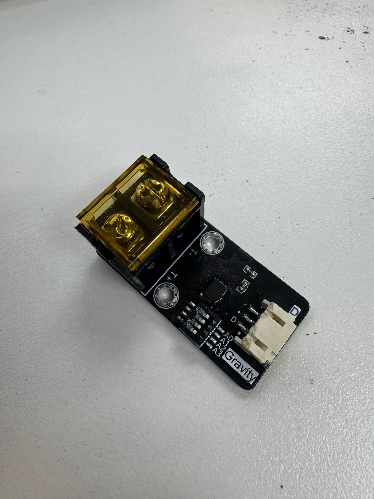

DFRobot_CT1780
===========================

* [中文版](./README_CN.md)

1-Wire High Temperature Sersor (K-type)


  
## Product Link (https://www.dfrobot.com)
    SKU: SEN0656

## Table of Contents

  * [Summary](#summary)
  * [Installation](#installation)
  * [Methods](#methods)
  * [Compatibility](#compatibility)
  * [History](#history)
  * [Credits](#credits)

## Summary

1-Wire High Temperature Sersor (K-type)

## Installation

To use this library, first download the library file, paste it into the \Arduino\libraries directory, then open the examples folder and run the demo in the folder.
This library depends on the OneWire library. Please install OneWire before using this library. Download method: Arduino IDE → Tools → Manage Libraries, search for "OneWire" and install it.
The current version of the OneWire library used is 2.3.8
## Methods

```C++
  /**
   * @fn: DFRobot_CT1780
   * @brief: Constructor, passing in the data pin of the CT1780 connection
   * @param pin: The pin of the OneWire data cable connection
   */
  DFRobot_CT1780(uint8_t pin);
  /**
   * @fn: searchDevice
   * @brief: Search for CT1780 device connected to the bus
   * @param newAddr:If a new device is retrieved, the 64-bit unique ID of the device is stored at that address
   * @return: Returns 1 if a new address has been returned. 0 might mean that the bus is shorted, there are no devices, or you have already retrieved all of them.
   */
  int searchDevice(uint8_t *newAddr );
  /**
   * @fn: getCelsius
   * @brief: Read probe temperature data
   * @param newAddr:device address
   * @return: float Temperature value (in degrees Celsius),Return NAN on failure.
   */
  float getCelsius(uint8_t *newAddr);

  /**
   * @fn: getConfigAddr
   * @brief: Get the user-configured address of CT1780 (in ScratchPad)
   * @param newAddr:device address
   * @return: address data,Return -1 on failure.
   */
  int getConfigAddr(uint8_t *newAddr);

```

## Compatibility

MCU                | Work Well    | Work Wrong   |   Untested   |
------------------ | :----------: | :----------: | :----------: | 
Arduino Uno        |      √       |              |              |
Mega2560           |      √       |              |              |
Leonardo           |      √       |              |              |
ESP32              |      √       |              |              |
ESP8266            |      √       |              |              |
micro:bit          |      √       |              |              |
FireBeetle M0      |      √       |              |              |


## History

- 2025-03-07 - Version 1.0.0 released.

## Credits

Written by fary(feng.yang@dfrobot.com), 2025. (Welcome to our [website](https://www.dfrobot.com/))
